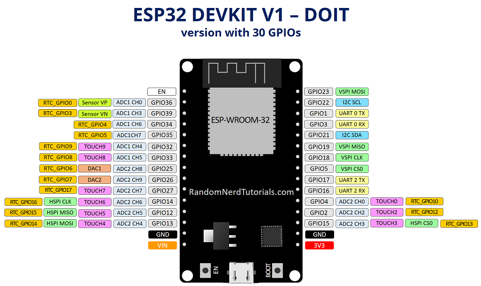

#
Ref: [https://docs.micropython.org/en/latest/library/index.html]MicroPython參考文件

1. 在虛擬/本機環境下: 
   安裝 ampy
   >> pip3 install adafruit-ampy
   or
   >> sudo pip3 install adafruit-ampy

2. 假如是 esp8266 based boards, 需要先用 picocom 終端機進入 ESP32s模組 REPL環境下:
   輸入 python 指令:
   >>> import esp
   >>> esp.osdebug(None)

3. ESP32s模組 RPEL環境下, 按下 Ctrl+a, 再按下 Ctrl+x離開.

4. 回虛擬/本機環境下, 輸入指令:
   >> ampy --port /dev/ttyUSB0 ls ##可看 ESP32s模組有哪些檔案.

   >> ampy --port /dev/ttyUSB0 put filename.py  ##可以上傳 filename.py到 ESP32s模組.

   >> ampy --port /dev/ttyUSB0 run filename.py  ##可以執行 filename.py程式.

   >> ampy --port /dev/ttyUSB0 get ufilename.py ##可以下載 ESP32s模組的 ufilename.py檔案.

   >> ampy --port /dev/ttyUSB0 mkdir /foo

   >> ampy --port /dev/ttyUSB0 rmdir /foo

   >> ampy --port /dev/ttyUSB0 rm /foo/bar.py

   *重點: 使用 ampy指令操作前, picocom要先登出 ESP32s模組.

~

